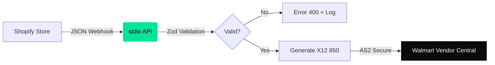

<Note>
stdio is not a SaaS. It is invisible infrastructure. We convert the bureaucratic chaos of EDI into clean, predictable JSON.
</Note>

## The Mission

We are the steel pipe through which millions of dollars flow. We do not design for "users". We design for The Cynical Developer who has 20 tabs open and hates marketing fluff.

## Architecture

<div className="my-4">

</div>

## Protocol Translation

We abstract the entire legacy EDI layer into a RESTful JSON API.

<CodeGroup>

```json stdio (JSON)
// POST /v1/orders/ingest
{
  "shopify_order_id": "54321",
  "retailer_code": "WALMART_US",
  "items": [
    { "sku": "WM-1001", "quantity": 500 }
  ]
}
```

```text Legacy (X12)
ISA*00*          *00*          *ZZ*SENDERID       *ZZ*RECEIVERID...
ST*850*0001~
BEG*00*NE*54321**20231212~
PO1*1*500*EA*12.50**VN*WM-1001~
SE*8*0001~
```

</CodeGroup>

## Operational Axioms

<CardGroup cols={2}>
<Card title="Dumb Pipe" icon="pipe">
We do not validate commercial logic. If you send garbage prices, we send garbage X12.
</Card>
<Card title="No Dashboard" icon="terminal">
Configuration is done via JSON. We don't have a drag-and-drop builder.
</Card>
<Card title="Fail Fast" icon="bolt">
Strict Zod schemas. We reject invalid data in &lt; 50ms with explicit error messages.
</Card>
<Card title="JSON First" icon="code">
You never have to read an EDI implementation guide.
</Card>
</CardGroup>