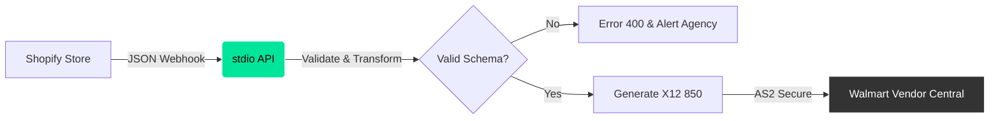

## System Status: EDI Protocol Deprecated

**stdio** is invisible infrastructure. We convert the bureaucratic chaos of EDI into clean, predictable JSON.

We do not build for "users". We build for **The Cynical Developer**.
You value `CTRL+C` / `CTRL+V`, clear documentation, and speed (&lt;100ms).
You hate welcome modals, guided tours, and marketing fluff.

## Architecture

<div className="my-4">

</div>

## Protocol Translation

We abstract the entire EDI layer into a clean, RESTful JSON API.

<CodeGroup>

```json stdio (JSON)
// POST /v1/orders/ingest
{
  "shopify_order_id": "54321",
  "retailer_code": "WALMART_US",
  "shipping_address": {
    "address1": "123 Sam Walton Ln",
    "city": "Bentonville",
    "state": "AR",
    "zip": "72712"
  },
  "items": [
    {
      "sku": "WM-1001",
      "quantity": 500
    }
  ]
}
```

```text Legacy (X12)
ISA*00*          *00*          *ZZ*SENDERID       *ZZ*RECEIVERID     *231212*1015*U*00401*000000001*0*P*>~
GS*PO*SENDERID*RECEIVERID*20231212*1015*1*X*004010~
ST*850*0001~
BEG*00*NE*54321**20231212~
N1*ST*WALMART DC 6023*9*0078742000008~
N3*123 SAM WALTON LN~
N4*BENTONVILLE*AR*72712~
PO1*1*500*EA*12.50**VN*WM-1001~
CTT*1~
SE*8*0001~
GE*1*1~
IEA*1*000000001~
```

</CodeGroup>

## Core Principles

1.  **Terminal-First**: Information Density > Whitespace.
2.  **Functional Brutalism**: No decoration. Sharp edges. High contrast.
3.  **Zero Click**: If you can do it via API, the UI is secondary.
